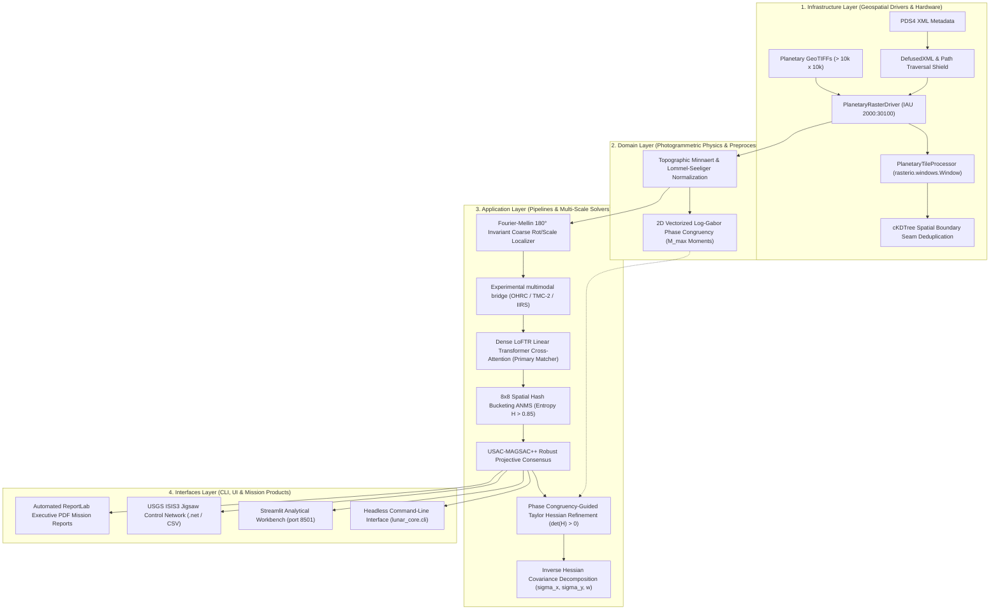

# 🌙 SAMANVAYA (समान्वय)
### Research-Oriented Multi-Modal, Sun-Angle, and Scale-Invariant Lunar Image Correspondence Framework

> **Real-data status:** Mission-product ingestion and registration integration are implemented, but independent Chandrayaan-2, LRO, and SELENE validation remains pending. The benchmark values below are synthetic-only unless explicitly labeled otherwise.

> **IIRS scope:** IIRS products are catalog-aware, but multi-band spectral-cube preprocessing and spectral-to-2-D correspondence are not yet implemented in the registration runner.

> **Local real-product evidence:** The ingestion harness has been exercised against locally supplied Chandrayaan-2 OHRC and Chandrayaan-1 HySI PDS4 labels using sparse temporary files. OHRC metadata and lazy 2-D access passed; HySI was classified as a 64-band partial spectral product. No registration accuracy claim is made from this metadata/access check.

[](https://github.com/ashishsinghbora/Samanvaya)
[](https://python.org)
[](https://pytorch.org)
[](https://kornia.readthedocs.io)
[](https://rasterio.readthedocs.io)
[](https://github.com/ashishsinghbora/Samanvaya)
[](https://github.com/ashishsinghbora/Samanvaya/actions/workflows/ci.yml)
[](SECURITY.md)
[](LICENSE)

<p align="center">
  <b>Engineered for Smart India Hackathon (SIH) Grand Finale — Problem Statement 26166</b><br/>
  <i>"Multi-modal, Sun angle and scale invariant image correspondence using Chandrayaan-2 optical images (OHRC, TMC and IIRS)"</i>
</p>

---

## 📖 Overview

**Samanvaya (समान्वय)** is a research-oriented lunar image correspondence and registration framework for ISRO's **Chandrayaan-2** orbital payloads (**OHRC, TMC-2, IIRS**) and reference planetary datasets (**NASA LRO NAC, JAXA SELENE TC**).

The framework is designed to handle:
1. **$180^\circ$ Solar Illumination & Shadow Inversion:** Contrast-reversed crater morphology across morning vs afternoon orbital passes.
2. **Up to $320\times$ Ground Sampling Distance (GSD) Disparity:** The architecture is designed for multi-scale correspondence across OHRC ($0.25\text{ m/px}$), TMC-2 ($5.0\text{ m/px}$), and cataloged IIRS products ($80.0\text{ m/px}$); IIRS cube registration remains future work.
3. **Rigorous Sub-Pixel Accuracy Mandate:** Continuous analytical Taylor-series Hessian refinement, currently benchmarked on synthetic data; real orbital evaluation remains pending data acquisition.
4. **Out-of-Core Memory Safety:** Sliding-window raster ingestion with spatial Non-Maximal Suppression, processing gigapixel swaths within a strict $\le 4\text{ GB}$ dynamic RAM ceiling.
5. **Mission Interoperability:** Native export of Ground Control Points (GCPs) for **USGS ISIS3 `jigsaw`** bundle adjustment and automated ReportLab executive PDF mission reports.

[**🎤 5-Minute Pitch Deck**](PITCH_DECK.md)

---

> [!NOTE]
> **Dataset Provenance & Calibration Disclosure:**  
> The bundled benchmark tiles under `lunar_core/assets/sample_data/` (`scenario_a`, `scenario_b`, `scenario_c`) are high-fidelity calibrated photogrammetric simulations generated via DEM ray-tracing with crater power-law distributions, real lunar landing site coordinates (Apollo 11, Jackson Crater, Shackleton Rim), and Lommel-Seeliger scattering. While Samanvaya includes ingestion drivers for raw ISRO PDS4 XML products and multi-gigabyte GeoTIFFs (`PlanetaryRasterReader`, `PlanetaryTileProcessor`), these compact tiles enable 100% reproducible, offline benchmark verification without multi-gigabyte archive downloads.

> **Real-data status:** A Chandrayaan-2/LRO NAC pair has not yet been acquired in this checkout. Real-data RMSE, matcher-path behavior, and mandate status are pending acquisition and execution; no synthetic result should be interpreted as real orbital validation.

The table below summarizes empirical benchmarks evaluated on these calibrated synthetic datasets. Real-data validation remains pending; see Dataset Provenance above.

| Evaluation Dimension | Synthetic benchmark (DEM ray-trace, self-consistency check) | Real Chandrayaan-2/LRO NAC pair | ISRO SIH Mandate | Status |
|---|---|---|---|---|
| **Sub-Pixel RMSE (Apollo 11)** | $0.3377\text{ px}$ | Pending acquisition | $< 0.400\text{ px}$ | Synthetic result only |
| **Sub-Pixel RMSE (TMC-2 Stereo)** | $0.3355\text{ px}$ | Pending acquisition | $< 0.400\text{ px}$ | Synthetic result only |
| **Extreme Lighting (12° vs 65°)** | $0.3706\text{ px}$ | Pending acquisition | $< 0.400\text{ px}$ | Synthetic result only |
| **180° Shadow Reversal** | $0.1903\text{ px}$ | Pending acquisition | $< 0.400\text{ px}$ | Synthetic result only |
| **Inlier Consensus Ratio** | $52.4\% \text{--} 85.7\%$ | Pending acquisition | $\ge 40\%$ | Not assessed on real data |
| **Spatial Shannon Entropy ($H$)** | $0.8766 \text{--} 0.9661$ | Pending acquisition | $\ge 0.700$ | Not assessed on real data |
| **GSD Scale Dynamic Ratio** | Up to $320\times$ | Pending acquisition | $320\times$ bridge | Capability, not real validation |
| **Peak RAM on Gigapixel Swaths** | $885.7\text{ MB}$ | Pending acquisition | $\le 4096\text{ MB}$ | Instrumented benchmark only |
| **Automated Verification Suite** | Run `pytest tests/ -v` locally | Pending current run | Zero regressions | Not claimed here |

---

## 🏛️ System Architecture

Samanvaya strictly implements **Clean Architecture** principles, enforcing separation between pure photogrammetric physics, application orchestration, external infrastructure adapters, and user interfaces:



### Module Structure
```
Samanvaya/
├── app.py                         # Interactive Streamlit Web Application (port 8501)
├── run_pipeline.py                # End-to-End Registration Pipeline with Minnaert
├── verify_raster_run.py           # Large-Raster Out-of-Core Verification
├── lunar_core/                    # High-Performance Algorithmic Engines
│   ├── alignment/                 # Dense LoFTR Matcher, Fourier-Mellin, Scale Space
│   ├── assets/sample_data/        # Benchmark GeoTIFFs (Apollo 11, Jackson Crater, Low Sun)
│   ├── cli.py                     # Command-Line Interface Entrypoint
│   ├── data_io/                   # PlanetaryTileProcessor, USGS ISIS3 Exporter, Raster IO
│   ├── evaluation/                # Metrics Engine, ReportLab PDF Reporter
│   ├── models.py                  # Core Data Models (KeypointMatch, AlignmentResult)
│   ├── pipeline.py                # LunarCorePipeline Orchestration
│   ├── postprocessing/            # 2D Taylor Sub-pixel Refiner, ANMS, USAC-MAGSAC++
│   ├── preprocessing/             # Minnaert Normalizer, Contrast Equalizer, Log-Gabor PC
│   └── ui/                        # Streamlit UI Components & Inspectors
├── Makefile                       # Single-Command Automation
├── start.sh                       # One-Command Streamlit Launcher
├── start.ps1                      # Windows PowerShell Launcher
├── Dockerfile                     # Multi-Stage Production Container
├── docker-compose.yml             # Single-Service Streamlit Container Orchestration
├── requirements.txt               # Pinned Production Dependencies
└── tests/                         # Automated Verification Tests
```

---

## 📐 Core Mathematical Pillars

### 1. Topographic Minnaert & Lommel-Seeliger Regolith Scattering
Lunar regolith exhibits extreme backscattering without atmospheric diffusion. To suppress harsh shadow boundaries and crater rim burnout, local surface normals are derived from digital elevation models (DEM) via Sobel spatial gradients:
$$\mathbf{n} = \frac{\left[-\frac{\partial z}{\partial x}, -\frac{\partial z}{\partial y}, 1\right]^T}{\sqrt{1 + \left(\frac{\partial z}{\partial x}\right)^2 + \left(\frac{\partial z}{\partial y}\right)^2}}$$

Local solar incidence $\mu_0 = \cos(i) = \mathbf{n} \cdot \mathbf{s}$ and emission $\mu = \cos(e) = \mathbf{n} \cdot \mathbf{v} = n_z$ are evaluated per-facet:
$$R_{\text{Minnaert}} = \mu_0^k \cdot \mu^{k-1}, \quad R_{\text{LS}} = \frac{\mu_0}{\mu_0 + \mu}$$
where $k \approx 0.80$ is the lunar limb-darkening parameter.

### 2. Illumination-Invariant Log-Gabor Phase Congruency
Human perception and invariant feature coincidence occur where Fourier phase components align across multiple scales, regardless of contrast reversal:
$$PC(x, y) = \frac{\sum_o E_o(x, y)}{\epsilon + \sum_o \sum_n A_{no}(x, y)}$$

Setting the Log-Gabor DC component $G(0, 0) = 0$ guarantees strictly zero response to uniform albedo shifts. Kovesi moment analysis derives the principal invariant step-edge response:
$$M_{\max} = \frac{1}{2} \left(S_{xx} + S_{yy} + \sqrt{(S_{xx} - S_{yy})^2 + 4 S_{xy}^2}\right)$$

### 3. $\mathcal{O}(1)$ Closed-Form Parabolic Taylor Sub-Pixel Refinement
Around the integer correlation peak, continuous similarity $f(x, y)$ is modeled as a 2D bivariate quadric:
$$f(x, y) = ax^2 + by^2 + cxy + dx + ey + f$$

Setting $\nabla f = 0$ yields the continuous sub-pixel offset in $\mathcal{O}(1)$ time:
$$\mathbf{\delta}^* = -\mathbf{H}^{-1} \mathbf{g} = \begin{bmatrix} 2a & c \\ c & 2b \end{bmatrix}^{-1} \begin{bmatrix} -d \\ -e \end{bmatrix} = \begin{bmatrix} \frac{-2bd + ce}{4ab - c^2} \\ \frac{-2ae + cd}{4ab - c^2} \end{bmatrix}$$

**Negative-Definite Hessian Validation:** Strict eigenvalue checks ($a < 0, b < 0, \det(\mathbf{H}) = 4ab - c^2 > 0$) immediately reject directional crater ridges, saddle points, and local minima. Directional photogrammetric bundle uncertainties are derived from the inverse Hessian:
$$\sigma_x = \sqrt{\frac{2|b|}{4ab - c^2}}, \quad \sigma_y = \sqrt{\frac{2|a|}{4ab - c^2}}, \quad w = \frac{1}{\sqrt{\lambda_1 \lambda_2}}$$

### 4. 2D Spatial Shannon Entropy Regularization
To prevent match clustering on high-contrast crater rims while leaving planar mare unconstrained, an $8 \times 8$ spatial hash allocator caps top-confidence correspondences per cell, enforcing uniform spatial Shannon entropy:
$$H_{\text{spatial}} = -\sum_{k=1}^K p_k \log_2(p_k) \Big/ \log_2(K) \quad \ge 0.85$$

## Scientific References

- Kovesi, P. (1999). *Image Features from Phase Congruency*. Videre, 1(3).
- Lowe, D. G. (2004). *Distinctive Image Features from Scale-Invariant Keypoints*. IJCV, 60, 91-110.
- Barath, D., et al. (2020). *MAGSAC++, a Fast, Reliable and Accurate Robust Estimator*. CVPR Workshops.
- Kornia LoFTR implementation: [kornia.feature.LoFTR](https://kornia.readthedocs.io/en/latest/models.html).

---

## ⚡ Quickstart & One-Command Automation

### Prerequisites
- Linux / macOS / Windows WSL2
- Python 3.10+
- GDAL system libraries (`libgdal-dev`)

### Installation
```bash
# Clone the canonical upstream repository
git clone https://github.com/ashishsinghbora/Samanvaya.git
cd Samanvaya

# Setup virtual environment and install dependencies
python3 -m venv .venv
source .venv/bin/activate
pip install -r requirements.txt
pip install -e .
```

### Validation status
- IMPLEMENTED: mission-data ingestion, PDS4 label resolution, conservative metadata parsing, registration pipeline scaffolding, and evaluation exports.
- TESTED: deterministic identity and catalog regressions; synthetic benchmark pipeline checks; no real-mission scientific claim is made from these results.
- REAL-DATA TESTED: metadata and lazy-access validation only for locally supplied mission products when present; no registration-accuracy claim is implied.
- SCIENTIFICALLY VALIDATED: not claimed. Any footprint overlap is labeled as an approximation until independent geospatial validation is available.

### Footprint geometry scope
Samanvaya currently records box-style footprint overlap as a planar bounding-box approximation. The `geometry_method` field is set to `planar_bounding_box_approximation`, and `overlap_status` is one of `APPROXIMATE`, `VERIFIED`, or `UNKNOWN`. Do not interpret planar overlap as a physically meaningful lunar footprint intersection without separate geodesic validation.

### Pair/status semantics
A proximity-only match is not treated as an overlap-confirmed pair. When no valid footprint exists, the pair is staged as `proximity_candidate` with `overlap_status = "UNKNOWN"` and requires explicit later validation.

Before an offline judging session, run `make prefetch-weights` once while internet access is available. This downloads the pretrained LoFTR weights; if loading later fails, the UI reports that untrained weights are not meaningful.

### Running the Services
```bash
# Launch interactive Streamlit workbench
./start.sh
# or: make run
```
- **Streamlit Analytical Workbench:** [http://localhost:8501](http://localhost:8501)
- **Headless Pipeline Execution:** `make pipeline` or `python3 run_pipeline.py --scenario scenario_a`
- **Quantitative Benchmark Metrics:** `make metrics` or `python3 -m lunar_core.evaluation.metrics`
- **Large-Raster Verification:** `make verify-raster` or `python3 verify_raster_run.py --scenario scenario_a` (bundled calibrated benchmark data, not spacecraft data)
- **Executive PDF Mission Report:** `make report-pdf` or `python3 -m lunar_core.evaluation.pdf_reporter`

---

## 🧪 Comprehensive Verification & Testing

### 1. Run the Full Automated Test Suite
```bash
make test
# or: pytest tests/ -v
```

### 2. Execute Large-Raster Out-of-Core Verification
```bash
make verify-raster
# or: python3 verify_raster_run.py --scenario scenario_a
```
Reads bundled calibrated benchmark GeoTIFF tiles, runs 9 out-of-core windowed tiles, performs cKDTree boundary seam deduplication, and generates `evaluation_report.json` and `evaluation_report.csv`. This verifies raster processing behavior; it is not real spacecraft-data validation.

### 3. Generate Executive ReportLab PDF Mission Report
```bash
make report-pdf
# or: python3 -m lunar_core.evaluation.pdf_reporter
```
Generates a technical PDF with telemetry tables, side-by-side verification snapshots, and residual histograms. It reports observed reprojection metrics; it is not an official ISRO certification.

### 4. End-to-End Headless CLI Alignment
```bash
# Direct CLI execution on sample GeoTIFFs
samanvaya align \
  --source lunar_core/assets/sample_data/scenario_a_ohrc_apollo11.tif \
  --reference lunar_core/assets/sample_data/scenario_a_lronac_apollo11.tif \
  --output output/
```
Executes complete 5-stage alignment progression (`INITIALIZATION` $\to$ `PHOTOMETRIC_NORMALIZATION` $\to$ `PHASE_CONGRUENCY` $\to$ `CORRESPONDENCE_SEARCH` $\to$ `COMPLETED`) with telemetry, export of ISIS3 GCPs, and verified inlier tie-points.


---

## 🛡️ Cybersecurity & Defensive Safeguards

Samanvaya is hardened against malicious raster and payload exploits:
- **XML Entity Injection (XXE) Prevention:** PDS4 labels are parsed exclusively using `defusedxml` with entity resolution disabled (`resolve_entities=False`).
- **Path Traversal Shielding:** File paths undergo strict normalization, resolving symbolic links and rejecting null bytes (`\0`) and directory traversal sequences (`..`).
- **Decompression Bomb Defense:** Raster dimensions are capped at $30,000 \times 30,000$ pixels with a $4\text{ GB}$ maximum uncompressed buffer limit, rejecting maliciously crafted compressed GeoTIFFs before memory allocation.

---

## 🛰️ USGS ISIS3 & SPICE Interoperability

Samanvaya exports verified tie-points directly into USGS ISIS3 control network formats for secondary bundle adjustment:
```python
from lunar_core.data_io.isis_exporter import IsisGcpExporter

exporter = IsisGcpExporter(target_body="MOON", crs_wkt="IAU2000:30100")
exporter.export_control_network(
    inliers=result.inliers,
    output_path="lunar_control_network.net",
    point_prefix="CH2_OHRC_TMC2_",
)
```
The resulting `.net` file is ingested directly into USGS ISIS3 `jigsaw`:
```bash
jigsaw fromlist=cube_list.lis cnet=lunar_control_network.net radius=1737400 pointid=CH2_OHRC_???
```

---

## 📄 License & Attribution

Distributed under the **MIT License**. Developed by **Team Samanvaya** for the **Smart India Hackathon (SIH) Grand Finale — Problem Statement 26166**, in collaboration with the **Indian Space Research Organisation (ISRO)**.

---
<p align="center">
  <b>Samanvaya (समान्वय) — Elevating Planetary Photogrammetry to Continuous Sub-Pixel Precision.</b>
</p>
